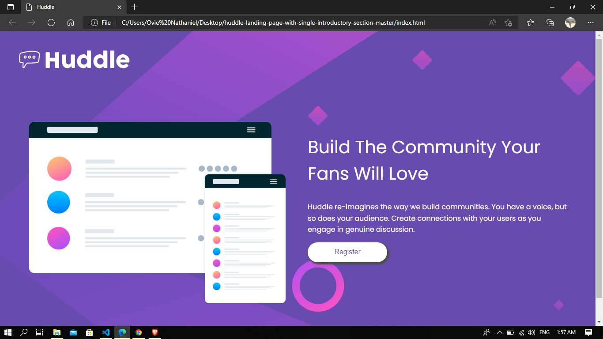
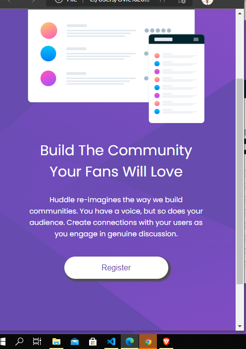

# Frontend Mentor - Huddle landing page with single introductory section solution

This is a solution to the [Huddle landing page with single introductory section challenge on Frontend Mentor](https://www.frontendmentor.io/challenges/huddle-landing-page-with-a-single-introductory-section-B_2Wvxgi0).

## Table of contents

- [Overview](#overview)
  - [The challenge](#the-challenge)
  - [Screenshot](#screenshot)
  - [Links](#links)
- [My process](#my-process)
  - [Built with](#built-with)
  - [What I learned](#what-i-learned)
  - [Continued development](#continued-development)
  - [Useful resources](#useful-resources)
- [Author](#author)

## Overview

This project was about creating a simple landing page for with a two column layout.

### The challenge

The challenge I had was in creating the two column layout and making it responsive.

Users should be able to:

- View the optimal layout for the page depending on their device's screen size
- See hover states for all interactive elements on the page

### Screenshot




### Links

- Solution URL: [Add solution URL here](https://your-solution-url.com)
- Live Site URL: [Add live site URL here](https://your-live-site-url.com)

## My process

### Built with

- Semantic HTML5 markup
- CSS custom properties
- CSS Grid
- Desktop-first workflow

### What I learned

I learned how to use the css grid in creating a two column layout and a little trick that made the writting of my
media query rules easier.

snippets

```css
.container {
  max-width: 1440px;
  margin: 0 auto;
  padding: 0 10px;
  display: grid;
  grid-template-columns: repeat(auto-fit, minmax(320px, 1fr));
  grid-column-gap: 45px;
  justify-content: center;
}
```

### Continued development

I will continue to focus on css grid, css flexbox and layout in general because this project helped me identify that am
not yet a master in laying out this on a webpage.

### Useful resources

- Learning web design 5th edition by Jennifer Robbins - This helped me for with the grid layout. I really liked this pattern and will use it going forward.

## Author

- Website - [Ovie Nathaniel](www.linkedin.com/in/ovie-nathaniel)
- Frontend Mentor - [@yourusername](https://www.frontendmentor.io/profile/@ovie-best)
- Twitter - [@yourusername](https://www.twitter.com/@ovie_best2)
